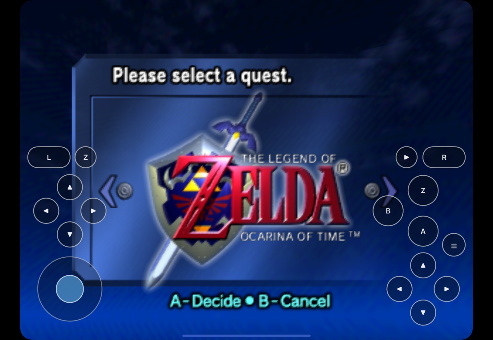
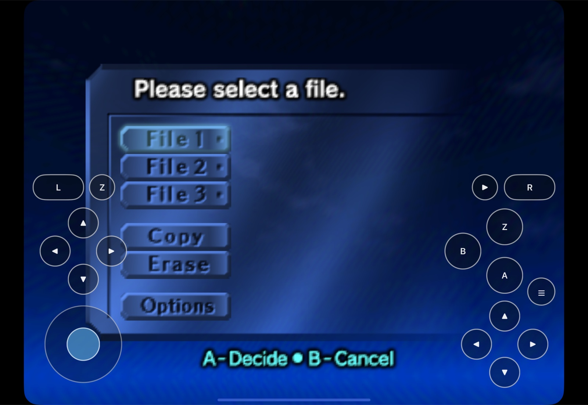
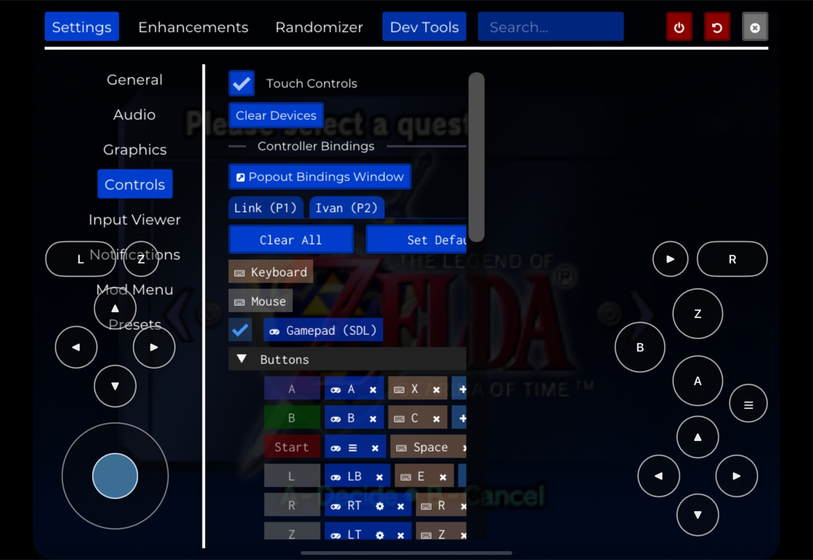
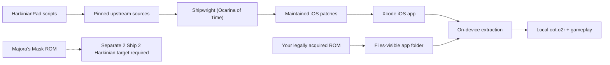

# HarkinianPad

<p align="center">
  <strong>Ocarina of Time on iPad, through Ship of Harkinian.</strong><br>
  Native Metal rendering, on-device setup, touch controls, and
  physical-controller support—with a clear path for a separate Majora's Mask port.
</p>

<p align="center">
  <a href="docs/remaining-work.md"></a>
  
  
  
  
</p>



HarkinianPad brings the complete
[Ship of Harkinian](https://github.com/HarbourMasters/Shipwright) application
to Apple mobile devices. It runs through SDL's UIKit entry point, renders
through Metal, discovers a user-provided ROM through Files, performs extraction
inside the app container, and offers a grip-first N64 touch layout alongside
iOS-compatible game controllers.

This repository contains the reproducible iOS integration—not either game.
HarkinianPad never ships a ROM or the ROM-derived archive needed to play.

> **Current status:** the full app builds for arm64 iPhoneOS and reaches the
> title and file-select flows on iPhone and iPad Simulator. Touch Start, A, B,
> Menu, and live overlay toggling have been exercised there. Signing,
> installation, physical grip/multitouch feel, controller gameplay, and a full
> Files import still require a real-iPad replay. The
> [proof ledger](docs/remaining-work.md) separates completed evidence from open
> hardware gates.

## Choose your game

HarkinianPad belongs to a family of Harbour Masters source ports, but the two
Zelda games use different engines and different game data. This checkout makes
that boundary explicit:

| Game | Upstream engine | HarkinianPad status |
|---|---|---|
| **The Legend of Zelda: Ocarina of Time** | [Ship of Harkinian](https://github.com/HarbourMasters/Shipwright) | **Supported now.** This repository builds the iOS/iPadOS app and imports a supported Ocarina of Time ROM on first launch. |
| **The Legend of Zelda: Majora's Mask** | [2 Ship 2 Harkinian](https://github.com/HarbourMasters/2ship2harkinian) | **Separate port required.** The mobile integration can be adapted to that engine, but this app does not currently accept or run a Majora's Mask ROM. |

<details>
<summary><strong>I have an Ocarina of Time ROM—what do I do?</strong></summary>

Build HarkinianPad, launch it once, then import your legally acquired supported
ROM through the Files-visible HarkinianPad folder. Start with the
[Simulator quick start](#build-for-simulator) or the
[real-iPad guide](docs/BUILDING.md).
</details>

<details>
<summary><strong>I have a Majora's Mask ROM—can I put it in HarkinianPad?</strong></summary>

Not in the current app. Majora's Mask is handled by the separate
[2 Ship 2 Harkinian](https://github.com/HarbourMasters/2ship2harkinian)
codebase, which has its own supported-ROM list and archive format. Bringing it
to iPad should reuse the small HarkinianPad mobile layer where practical, while
remaining a separate build target rather than pretending the two ROMs are
interchangeable.
</details>

## Why HarkinianPad exists

Ship of Harkinian already turns Ocarina of Time into a modern native source
port. Libultraship already contains important iOS foundations. The missing
piece was a complete, reproducible mobile product path connecting those layers:

- a full Shipwright arm64 iOS build rather than an engine-only compile;
- Metal and UIKit integration that survives the application lifecycle;
- first-run setup that works through the Files-visible app container;
- controls designed for an iPad held at both edges;
- a ROM-free package audit and an explicit signed-installation gate; and
- durable downstream patches that can be replayed on exact upstream revisions.

That makes HarkinianPad useful beyond a one-off local build. It is a documented
mobile-port baseline: every downstream change lives here, every upstream input
is pinned, and every remaining hardware claim is called out instead of assumed.

## What is different

| | Desktop Ship of Harkinian | HarkinianPad |
|---|---|---|
| Platform shell | Desktop windowing and file flows | Native iOS/iPadOS app through SDL UIKit |
| Rendering | Desktop backends | Metal on iPhone and iPad |
| First run | Desktop ROM selection | Files-visible discovery and extraction inside the app container |
| Touch | Not a desktop requirement | Complete lower-half N64 layout, enabled by default |
| Controller | Desktop gamepads | Existing SDL controller path for iOS-compatible controllers |
| Mobile UI | Desktop-scale menus | Adaptive iPhone/iPad menu scaling and non-quitting recovery flows |
| Distribution safety | Platform-specific packaging | ROM-free app/IPA audit plus a strict signed-package gate |
| Source strategy | Upstream repository | Pinned, fetch-only upstream inputs with reviewable HarkinianPad patches |

HarkinianPad does not replace or impersonate its upstream projects. It is the
iOS integration layer around them, and `chrissotraidis/harkinianpad` is the
only repository to which this project's changes are published.

## See it running

<table>
  <tr>
    <td width="50%">
      
    </td>
    <td width="50%">
      
    </td>
  </tr>
  <tr>
    <td align="center"><strong>Immediately testable</strong><br>All N64 inputs are available from a clean launch.</td>
    <td align="center"><strong>Out of the way when needed</strong><br>Touch controls toggle live under Settings → Controls.</td>
  </tr>
</table>

These captures are from the real iPad Pro 11-inch Simulator build, not a
mockup. The game imagery comes from a locally supplied ROM and is shown only
to document the port in operation.

## What works today

| Area | Verified result |
|---|---|
| Reproducible source | Exact Shipwright, libultraship, ZAPDTR, and OTRExporter revisions are pinned; upstream push URLs are disabled |
| Native app | Complete Shipwright configures, compiles, and links for arm64 iOS 14+ |
| Rendering | Live title and file-select scenes render through Metal on iPhone and iPad Simulator |
| First-run setup | Files-visible ROM discovery and on-device `.o2r` generation pass clean Simulator replays |
| Touch | 16 discrete buttons plus a low control stick; Start/A/B/Menu and live off/on behavior exercised |
| Controllers | Existing SDL game-controller bindings are built in; physical-device gameplay remains an open acceptance gate |
| Lifecycle | Repeated suspend/resume, config flush, audio interruption, and low-memory dispatch pass in Simulator |
| Packaging | ROM-free app/IPA audit passes; unsigned proof artifacts are rejected by the signed-only gate |

Simulator evidence is not presented as physical-device evidence. The exact
open matrix—real audio, Files import, controller reconnect/capabilities,
multitouch feel, persistence after termination, signing, and installation—is
maintained in [`docs/remaining-work.md`](docs/remaining-work.md).

## How the build stays reproducible



The compile does not read your ROM. `scripts/build-ios.sh` fetches and verifies
the pinned source inputs, disables their push URLs, applies this repository's
patches, generates Shipwright's ROM-free `soh.o2r`, and builds the complete
app. The user's ROM is introduced only after installation and the resulting
`oot.o2r` stays inside the app container.

## Quick start

### Build for Simulator

You need macOS, Xcode and its command-line tools,
[Homebrew](https://brew.sh), and a legally acquired supported Ocarina of Time
ROM for first-run setup.

```sh
brew install cmake ninja pkgconf sdl2 glew nlohmann-json libpng \
  libogg libvorbis opus opusfile

git clone https://github.com/chrissotraidis/harkinianpad.git
cd harkinianpad

# Optional ignored holding area; the build never reads this ROM.
cp "/path/to/your-supported-oot-rom.v64" ref/

scripts/build-ios.sh --simulator
```

The product is written to:

```text
build-ios-soh-sim/soh/Release-iphonesimulator/HarkinianPad.app
```

### Build and sign for a real iPad

Choose a bundle identifier you control and the 10-character development-team
identifier shown by Xcode:

```sh
DEVELOPMENT_TEAM=ABCDE12345 \
BUNDLE_ID=com.yourname.harkinianpad \
scripts/build-ios.sh --device
```

If Xcode needs to register the device or create a profile, open
`build-ios-soh/Ship.xcodeproj`, select the `soh` scheme and your iPad, then
choose your team under **Signing & Capabilities**.

Before treating the result as installable, run the strict audit:

```sh
REQUIRE_SIGNED=1 scripts/package-ios.sh
```

The audit refuses Simulator products, missing signing/provisioning, original
ROMs, ROM-derived `oot*.o2r`/`.otr` files, and prohibited game data inside
`soh.o2r`. See the complete
[build and physical-device guide](docs/BUILDING.md) before installation.

## First launch

1. Open HarkinianPad once so iOS creates its Files-visible folder.
2. In Files, move your supported ROM to **On My iPad → HarkinianPad**.
3. Return to HarkinianPad and choose **Rescan**.
4. Leave the app open while it creates the local archive.
5. Press the on-screen **Start** button, or use a connected controller.

The original ROM and generated `oot.o2r` remain local. They are ignored by
Git, excluded from CI, and rejected by the package audit.

## Controls

The overlay is designed around the lower half of a landscape iPad so both
hands can remain on the side edges:

- **Left:** L/Z shoulder row, separate D-pad, and a low eight-way control stick.
- **Right:** Start/R shoulder row, A/B/Z cluster, Menu, and a separate low
  C-button diamond.
- **Toggle:** open **☰ → Settings → Controls → Touch Controls**.

| Touch control | Existing Shipwright binding |
|---|---|
| Control stick | W/A/S/D, including diagonals |
| D-pad | T/G/F/H |
| A / B | X / C |
| L / Z / R | E / Z / R |
| Start | Space |
| C buttons | Arrow keys |
| Menu | Escape |

The touch stick is intentionally a simple eight-way testing control. A
physical controller remains the reference path for analog precision. The full
layout and acceptance contract are in
[`docs/touch-controls-design.md`](docs/touch-controls-design.md).

## Frequently asked questions

<details>
<summary><strong>Is HarkinianPad an emulator?</strong></summary>

No. It is an iOS integration of Ship of Harkinian, a native source port built
from the Ocarina of Time decompilation project and libultraship. Your supported
ROM is used locally to generate the data archive the source port requires.
</details>

<details>
<summary><strong>Does this repository include Ocarina of Time?</strong></summary>

No. It contains no ROM and no playable ROM-derived archive. You must provide
your own legally acquired supported copy. Do not open an issue asking for game
data or download links.
</details>

<details>
<summary><strong>Does HarkinianPad run Majora's Mask?</strong></summary>

Not today. The current app is built from Ship of Harkinian and accepts supported
Ocarina of Time data. Majora's Mask uses
[2 Ship 2 Harkinian](https://github.com/HarbourMasters/2ship2harkinian);
support requires a separate integration and build target. A Majora's Mask ROM
placed in `ref/` or the app's Files folder will not make this binary compatible.
</details>

<details>
<summary><strong>Can another Mac reproduce the build if my ROM is under <code>ref/</code>?</strong></summary>

Yes. Everything except `ref/README.md` is ignored there, and the ROM is not a
compile input. A clean checkout fetches exact upstream revisions and replays
the maintained patches. You import the ROM into the installed app later.
</details>

<details>
<summary><strong>Can I install the unsigned IPA from CI or <code>scripts/package-ios.sh</code>?</strong></summary>

Not on a standard device. The unsigned IPA is reproducibility and package-audit
proof only. A real iPad build needs your Apple development team, unique bundle
identifier, valid signature, and provisioning profile.
</details>

<details>
<summary><strong>Do Bluetooth and USB controllers work?</strong></summary>

HarkinianPad retains SDL's iOS game-controller path and the existing Shipwright
bindings for compatible controllers. The app builds with that path enabled,
but the physical-device gameplay, reconnect, rumble, and motion matrix is still
an explicit hardware acceptance gate.
</details>

<details>
<summary><strong>Can I hide the touch controls?</strong></summary>

Yes. Use **Settings → Controls → Touch Controls**. The change is immediate,
persists through Shipwright's configuration system, and releases held input
when the overlay is removed.
</details>

<details>
<summary><strong>Why does Enter do nothing at the title screen?</strong></summary>

Start uses Shipwright's existing **Space** binding. The built-in touch layout
exposes a dedicated Start button, so no keyboard is required for basic
Simulator navigation.
</details>

<details>
<summary><strong>Is this an App Store or TestFlight release?</strong></summary>

No. The current scope is a reproducible local Xcode build and physical-device
test path. App Store, TestFlight, AltStore PAL, and SideStore distribution each
have separate signing, review, account, and regional requirements.
</details>

<details>
<summary><strong>What is the licensing status?</strong></summary>

Each upstream component retains its own license and copyright. Libultraship,
ZAPDTR, OTRExporter, SDL, and their dependencies use permissive licenses. The
pinned Shipwright tree has no top-level license file; that unresolved upstream
gap is documented in the
[licensing findings](docs/findings/05-priorart-licensing.md) and should be
settled before broad binary distribution.
</details>

<details>
<summary><strong>What remains before calling the port complete?</strong></summary>

A signed real-iPad replay: Files import and extraction, sustained touch and
controller gameplay, simultaneous multitouch feel, controller reconnect and
capabilities, speaker/headphone audio, lifecycle persistence, and final
ROM-free package verification. Follow the
[authoritative queue](docs/remaining-work.md), not assumptions.
</details>

## Project map

| Path | Purpose |
|---|---|
| [`scripts/build-ios.sh`](scripts/build-ios.sh) | Clean-machine full-app build entry point |
| [`scripts/clone-sources.sh`](scripts/clone-sources.sh) | Fetch and verify pinned, push-disabled inputs |
| [`scripts/generate-port-archive.sh`](scripts/generate-port-archive.sh) | Generate and audit Shipwright's ROM-free app resource |
| [`scripts/package-ios.sh`](scripts/package-ios.sh) | Audit signing, device platform, and package contents |
| [`patches/`](patches/) | Reviewable HarkinianPad changes replayed onto pinned sources |
| [`docs/BUILDING.md`](docs/BUILDING.md) | Simulator, signing, physical-device, controller, and packaging guide |
| [`docs/touch-controls-design.md`](docs/touch-controls-design.md) | Touch layout, mapping, and acceptance contract |
| [`docs/remaining-work.md`](docs/remaining-work.md) | Authoritative milestone queue and evidence ledger |
| [`docs/ios-feasibility-and-implementation-plan.md`](docs/ios-feasibility-and-implementation-plan.md) | Architecture, decisions, risks, and acceptance gates |
| [`docs/findings/`](docs/findings/) | Source-cited platform, rendering, audio, filesystem, and licensing research |
| [`ref/`](ref/) | Ignored local reference area; only its safety README is tracked |

Generated `sources/`, `build*/`, `artifacts/`, ROMs, and ROM-derived archives
are ignored and must never be staged.

## Contributing

Keep changes small, testable, and owned by this repository:

1. Reproduce the relevant gate before editing.
2. Make the narrowest HarkinianPad change that closes it.
3. Re-run the Simulator or device/package check appropriate to the change.
4. Update the proof ledger with observed behavior and remaining risk.
5. Never commit a ROM, `oot*.o2r`, `.otr`, extracted asset, signing secret, or
   generated upstream checkout.

Do not push HarkinianPad changes to Shipwright, libultraship, ZAPDTR,
OTRExporter, or forks made only for reference. Upstream contribution is a
separate, deliberate process.

## Legal and acknowledgements

HarkinianPad is an unofficial community project and is not affiliated with or
endorsed by Nintendo or Harbour Masters. The repository does not provide the
game, a ROM, or the playable ROM-derived archive. Documentation screenshots
show a legally supplied local copy running in Simulator and are included only
to demonstrate this port.

This work builds on Ship of Harkinian, libultraship, ZAPDTR, OTRExporter, the
Ocarina of Time decompilation project, SDL, and their contributors. All
projects and trademarks belong to their respective owners.
